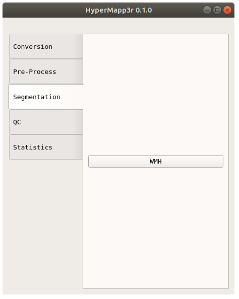
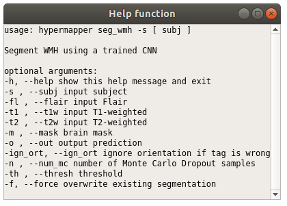

# Getting started

You can use HyperMapp3r through the graphical user interface (GUI) or command line:

## For GUI

To start the GUI, type

    hypermapper

A GUI that looks like the image below should appear. You can hover any of buttons in the GUI to see a brief description of the command.

You can get the command usage info by click the "Help" box on any of the pop-up windows.

## For Command Line

You can see all the hypermapper commands by typing either of the following lines:

    hypermapper -h
    hypermapper --help

Once you know the command you want to know from the list, you can see more information about the command. For example, to learn more about seg_wmh:

    hypermapper seg_wmh -h
    hypermapper seg_wmh --help

## WMH volumes
To extract WMH volumes use the GUI (Stats/WMH) or command line:

    hypermapper stats_wmh -h

## QC
QC files are automatically generated in a sub-folder within the subject folder.
They are .png images that show a series of slices in the brain to
help you quickly evaluate if your command worked successfully,
especially if you have run multiple subjects.
They can also be created through the GUI or command line:

    hypermapper seg_qc -h

The QC image should look like this:

## Logs
Log files are automatically generated in a sub-folder within the subject folder.
They are .txt files that contain information regarding the command
and can be useful if something did not work successfully.

## File conversion

Convert Analyze to Nifti (or vice versa)

    hypermapper filetype

    Required arguments:
    -i , --in_img    input image, ex:MM.img
    -o , --out_img   output image, ex:MM.nii

    Example:
    hypermapper filetype --in_img subject_T1.img --out_img subject_T1.nii.gz

