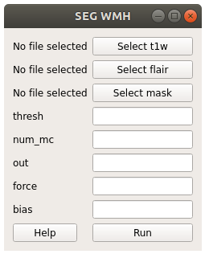
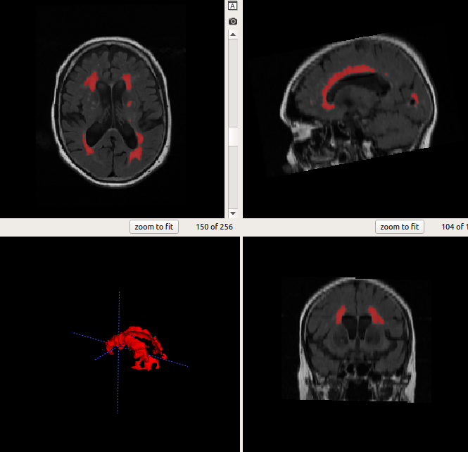

########################
# Segmentation tutorials
########################

## GUI

After opening the HyperMapper GUI, click "WMH" under the "Segmentation" tab. Wait for a new pop-up window to appear. 

Click "Select t1w" and chose your T1 image.

Type your desired output name in the "out" box. Click "Run".
Your output file will automatically appear in your t1w folder.

## Command Line

    hypermapper seg_wmh
    
    optional arguments:
    -h, --help            show this help message and exit
    -s , --subj           input subject
    -fl dir, --flair dir  input Flair
    -t1 , --t1w           input T1-weighted
    -m , --mask           brain mask
    -o , --out            output prediction
    -ign_ort, --ign_ort   ignore orientation if tag is wrong
    -n , --num_mc         number of Monte Carlo Dropout samples
    -th , --thresh        threshold
    -f, --force           overwrite existing segmentation
    
    Examples:
    hypermapper seg_wmh -s subjectname -b
    hypermapper seg_wmh -t1 subject_T1_nu.nii.gz -fl subject_T1acq_nu_FL.nii.gz -m subject_T1acq_nu_HfB.nii.gz -o subject_wmh_pred.nii.gz

    
The output should look like this.:

